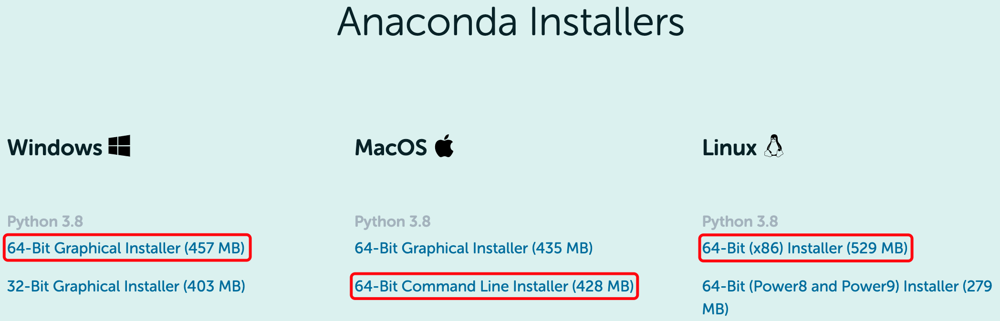

# PyGMT Tutorial in 2021

An preliminary introduction to [PyGMT](https://www.pygmt.org/) for MIG members.

## Installation instructions

**Anaconda** is a Python distribution for scientific computing and is **strongly
recommended**.

1.  Download Anaconda

    Go to [Anaconda download](https://www.anaconda.com/products/individual#Downloads),
    you can see a downloading page similar to the below snapshot. Choose the corresponding
    package based on your operating system. Those indicated in red boxes are usually
    used.

    

2.  Install Anaconda

    Just double-click the installer to install Anaconda for Windows.

    Please replace the following installer name by your one.
    ```
    # Linux
    $ bash Anaconda3-2020.11-Linux-x86_64.sh

    # macOS
    $ bash Anaconda3-2020.11-MacOSX-x86_64.sh
    ```

    It may take a few minutes to install Anaconda. At last, we could see:
    ```
    Do you wish the installer to initialize Anaconda3 by running conda init? [yes|no]
    [yes] >>>
    ```
    It is recommended to input `yes`, then the installer will initiliaze `conda`
    in the setting file of Shell (e.g., `~/.bashrc` or `~/.zshrc`)

3.  Test the installation

    Open a new terminal and input `python`. If we can see **Anconda, Inc.**, it
    means Anaconda is installed successfully.

    ```
    $ python
    Python 3.8.5 (default, Sep  4 2020, 02:22:02)
    [Clang 10.0.0 ] :: Anaconda, Inc. on darwin
    Type "help", "copyright", "credits" or "license" for more information.
    >>>
    ```

Installation instructions for PyGMT can be found
[here](https://www.pygmt.org/latest/install.html). To run the tutorial
notebooks, you'll also need to
[install Jupyterlab or Jupyter Notebook](https://jupyter.org/install).
The tutorial environment, containing both two above requirements, is specified
in the `environment.yml` file found in this repository. It can be installed via
[conda](https://docs.conda.io/en/latest/) with the following command:
```
conda env create
```

If local installation is challenging or impossible, you can access this environment
on a cloud machine by clicking on the badge below — **but note that your work will
not be saved between sessions with this method, so download your work (e.g.,
notebooks) often!** 🚨

[](https://binder.pangeo.io/v2/gh/MIGG-NTU/PyGMT2021/master)

## Reference tutorial material

- [PyGMT tutorial submission for SciPy 2021](https://github.com/GenericMappingTools/scipy2021)
- [PyGMT tutorial at ROSES 2020](https://github.com/fdannemanndugick/roses2020/tree/master/unit08)
- [PyGMT workshop at FOSS4G Oceania 2019](https://github.com/GenericMappingTools/foss4g2019oceania)
